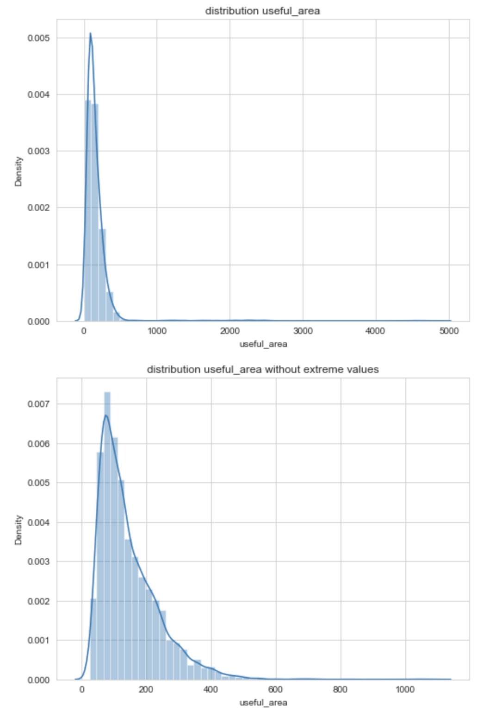

## How to use?

```
- pip install outliers_filtering
- from outliers_filtering.utils import remove_outliers_numeric, plot_distribution_numeric

* Two functions:

-- remove_outliers_numeric 
-- plot_distribution_numeric

```

Let's see how to use the functions.

First the function remove_coutliers_numeric, it applies an IQR outliers filtering to normal or lognormal numerical pandas columns.


```
remove_coutliers_numeric(df,feature,option = "lognormal",delta=1.5)

- df: is the pandas dataframe where to apply the outlier removal
- feature: name of the column to apply the function
- option: shape of the distribution, either "normal" or "lognormal"
- delta: coefficient to remove outliers outside IQR. default value is 1.5, the higher it is the less outliers you remove.
```

Example:


Second the function plot_distribution_numeric, it can plot distribution with and without outliers.

```
plot_distribution_numeric(df, feature, option = 'lognormal',title = 'distribution', mode = 'with_outliers')

- df: is the pandas dataframe where to apply the function
- feature: name of the column to plot the distribution
- option: shape of the distribution, either "normal" or "lognormal"
- title: Title of the plot
- mode: Two possible modes "with_outliers" to plot the raw distribution and "without_outliers" to plot distribution without outliers
```

Example:

```
plot_distribution_numeric(data,'useful_area', option = 'lognormal',title = 'distribution useful_area', mode='with_outliers')
plot_distribution_numeric(data, 'useful_area', option = 'lognormal', title = 'distribution useful_area without extreme values', mode='without_outliers')
```

